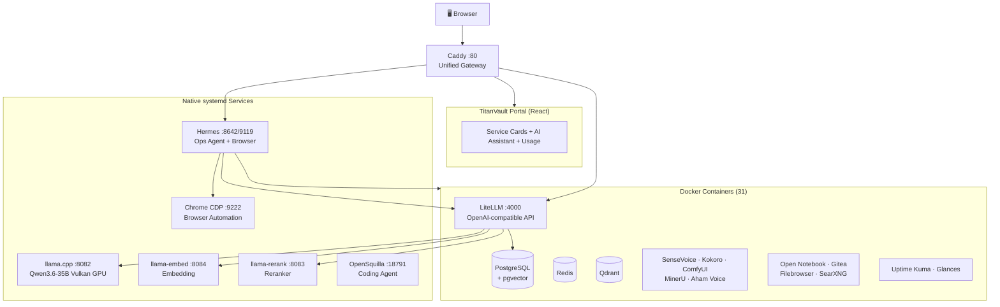

<div align="center">


# TitanVault

**A turnkey, fully-local AI workstation engineered for the AMD Ryzen AI Max+ 395.**

One command turns a 395 mini-PC into a complete AI stack — LLM inference, voice, document parsing, browser automation, agents, and monitoring — all running on-device, zero cloud, zero data egress.

[](https://github.com/OWNER/TitanVault/actions)
[](LICENSE)
[](https://github.com/OWNER/TitanVault/stargazers)
[](https://github.com/OWNER/TitanVault/commits)
[](https://www.amd.com/en/products/processors/laptop/ryzen/ai-300-series.html)

**English** · [简体中文](./readme/zh_HANS.md)

</div>

<div align="center">

**🔧 Zero-config · 📦 Out-of-the-box · 🖥️ 100% Local · 🔒 Zero data egress**

</div>

<picture>
  <source media="(prefers-color-scheme: dark)" srcset="./readme/portal-dashboard.png">
  
</picture>

---

## ✨ What's Inside

| Capability | What it does | Powered by |
|---|---|---|
| 🧠 **LLM Inference** | Qwen3.6-35B full offload, multimodal (vision + text) | llama.cpp (Vulkan) |
| 🎙️ **Speech** | ASR transcription · TTS synthesis · meeting minutes | SenseVoice · Kokoro · Aham Voice |
| 📄 **Documents** | PDF parsing with layout + OCR + tables | MinerU (ROCm GPU) |
| 🎨 **Images** | Stable Diffusion generation | ComfyUI (ROCm GPU) |
| 🤖 **AI Agents** | Ops agent (manages Docker/systemd) · Coding agent | Hermes · OpenSquilla |
| 🌐 **Browser Automation** | AI-driven Chrome: click, type, navigate, screenshot | browser-use + CDP |
| 📚 **Apps** | Knowledge base · Git · File manager · Meta-search | Open Notebook · Gitea · Filebrowser · SearXNG |
| 📊 **Monitoring** | 18 services auto-monitored · system resources | Uptime Kuma · Glances |

Everything is fronted by a **Caddy gateway** (:80) with a custom **TitanVault portal** — a React dashboard aggregating all service entries, an AI assistant, and a usage panel.

## 🔥 Why This Exists

Most "AI workstation" guides leave you cobbling together a dozen tools, debugging GPU drivers for days, and hand-configuring every service. **TitanVault is the opposite:**

- **🔧 Fully automated** — One `bash install.sh` does everything: GPU drivers, Docker, image builds, model downloads, service orchestration, password generation, monitoring setup. Zero manual config.
- **📦 Out of the box** — Open Notebook auto-configured with 4 model types; Uptime Kuma auto-seeded with 18 service monitors; Hermes ops agent pre-loaded with hardware knowledge. Nothing to "set up" after install.
- **🖥️ 100% local** — All inference runs on your 395's GPU. No API keys, no cloud calls, no data leaving your machine. Works offline after first install.
- **🔒 Private by design** — Passwords auto-generated, Caddy injects auth headers, `.env` locked to `600`. Your conversations, documents, and voice data never touch a third party.
- **🔁 Reinstall-safe** — Idempotent installer with credential fingerprinting. Reinstall or upgrade without breaking existing data.

## 🚀 Quick Start

```bash
git clone https://github.com/OWNER/TitanVault.git
cd TitanVault
bash install.sh
```

The installer walks you through preset selection, auto-installs GPU drivers, pulls images, downloads models, and starts everything. A fresh install takes ~1 hour (30 min is model download). Reinstalls with cached images/models take ~15 min.

<details>
<summary><b>📋 Installation phases</b></summary>

| Phase | What | Time | Interactive? |
|---|---|---|---|
| 0 | Hardware check (gfx1151 + Ubuntu) | 5s | No |
| 1 | Config (preset / data dir / model source) + generate passwords | 2 min | **Yes** |
| 2 | GPU drivers (GRUB + Mesa + Vulkan), one reboot | ~15 min | Reboot |
| 3 | Docker + images (build ROCm + pull third-party + offline packs) | ~30 min | No |
| 4 | Model download (35B + embed + rerank + ASR) | ~30 min | No |
| 5 | Start (compile llama.cpp + compose up + hermes/opensquilla/chrome) | ~10 min | No |
| 6 | Done — prints access URLs + passwords | instant | Save passwords |

</details>

## 🎛️ Three Presets

| Preset | Includes | For |
|---|---|---|
| **minimal** | LLM core (llama.cpp + LiteLLM + portal) | Just need a local LLM API |
| **standard** | + Speech / Docs / Images (AI capability layer) | Need voice/doc/image AI |
| **full** | + Apps + Monitoring + Agents + Browser automation | Complete workstation **(recommended)** |

## 🏗️ Architecture



## 📡 Key Ports

| Port | Service | Description |
|---|---|---|
| **80** | Caddy + TitanVault | Unified portal entry |
| 4000 | LiteLLM | OpenAI-compatible API (chat / embedding / rerank) |
| 8082 | llama-main | Qwen3.6-35B inference (native systemd) |
| 9119 | Hermes Dashboard | Ops Agent Web UI (general chat) |
| 8642 | Hermes Gateway | Ops Agent API (portal AI assistant) |
| 18791 | OpenSquilla | Coding Agent Gateway |
| 9222 | Chrome CDP | Browser automation backend |
| 9991 | SenseVoice | ASR API |
| 8188 | ComfyUI | Stable Diffusion |
| 8090 | MinerU Web | PDF parsing |
| 3001 | Uptime Kuma | Service monitoring |

<details>
<summary><b>Full port table (19 services)</b></summary>

| Port | Service |
|---|---|
| 80 | Caddy + TitanVault portal |
| 4000 | LiteLLM |
| 8082 / 8084 / 8083 | llama.cpp main / embed / rerank |
| 9119 / 8642 | Hermes dashboard / gateway |
| 18791 | OpenSquilla |
| 9222 | Chrome CDP |
| 9991 / 8081 | SenseVoice ASR / Kokoro TTS |
| 8765 | Aham Voice (meeting minutes) |
| 8090 / 18080 | MinerU web / API |
| 8188 | ComfyUI |
| 8088 / 5055 | Open Notebook |
| 3002 | Gitea |
| 8085 / 8087 | Filebrowser / SearXNG |
| 3001 | Uptime Kuma |
| 61208 | Glances |

</details>

## 🔧 Hardware Requirements

| Requirement | Spec |
|---|---|
| **APU** | AMD Ryzen AI Max+ 395 (Radeon 8060S / gfx1151) |
| OS | Ubuntu 24.04 / 26.04 LTS |
| RAM | 64 GB+ (for 35B full offload) |
| Storage | 120 GB+ (models 31G + images 70G + data) |
| Network | Internet for first install (images + models) |

> Only supports the 395. The installer checks GPU model in Phase 0 and rejects mismatches. Other GPUs (NVIDIA / Intel / other AMD) are out of scope.

## 📁 Repository Structure

```
TitanVault/
├── install.sh              # One-command installer (Phase 0-6)
├── compose.yaml            # Compose include entry (7-layer profiles)
├── compose/                # Layered orchestration
├── images/                 # Custom image sources (titanvault/sensevoice/mineru-rocm/...)
├── native/                 # Native systemd services (llama.cpp/hermes/opensquilla/chrome-cdp)
├── config/                 # Config templates (.env.example/caddy/litellm/hermes)
├── presets/                # minimal/standard/full toggles
├── hardware/               # aimax-395 specific params
├── models/                 # Model manifest + download sources
├── scripts/                # download-models.sh / setup-kuma.sh / ...
├── images/offline/         # Pre-packaged offline images
└── docs/                   # User documentation
```

## 📖 Documentation

- **[Quick Start](docs/getting-started.md)** — From zero to running
- **[Service Catalog](docs/what-it-installs.md)** — Complete service & port list
- **[Operations](docs/operations.md)** — Daily ops & service management
- **[Troubleshooting](docs/troubleshooting.md)** — Common issues & fixes
- **[Customization](docs/customize.md)** — Adjust models / ports / passwords

## 🤝 Contributing

See **[CONTRIBUTING.md](CONTRIBUTING.md)**. This project only targets the AMD Ryzen AI Max+ 395 — PRs adding other GPU support can't be tested and will be declined.

## 📜 License

Apache-2.0 — see [LICENSE](LICENSE). Third-party components retain their original licenses — see [NOTICE](NOTICE).

## ⭐ Star History

<picture>
  <source media="(prefers-color-scheme: dark)" srcset="https://api.star-history.com/svg?repos=OWNER/TitanVault&type=Date&theme=dark">
  <source media="(prefers-color-scheme: light)" srcset="https://api.star-history.com/svg?repos=OWNER/TitanVault&type=Date">
  
</picture>

---

<div align="center">

Built with ❤️ on top of [llama.cpp](https://github.com/ggml-org/llama.cpp) · [LiteLLM](https://github.com/BerriAI/litellm) · [Hermes](https://github.com/NousResearch/hermes-agent) · [browser-use](https://github.com/browser-use/browser-use) · [MinerU](https://github.com/opendatalab/MinerU) · [ComfyUI](https://github.com/comfyanonymous/ComfyUI)

</div>
