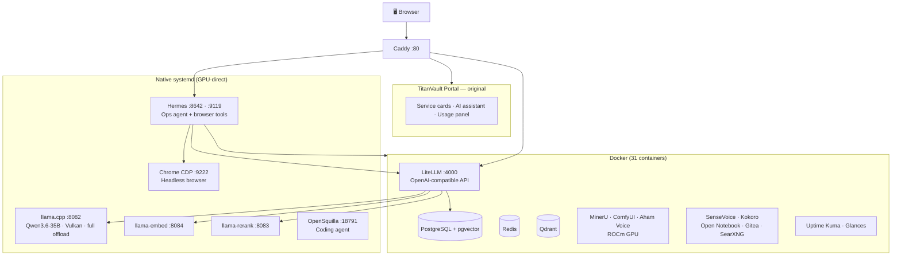

<div align="center">


# TitanVault

**A fully-local AI workstation for AMD Ryzen AI Max+ 395 (Strix Halo).**

One command turns a Strix Halo mini-PC into a complete on-device AI stack — LLM inference, voice, document parsing, browser automation, AI agents — all running locally, no cloud, no API keys.

[](LICENSE)
[](https://github.com/kaka86mm/TitanVault/stargazers)
[](https://github.com/kaka86mm/TitanVault/commits)
[-ED1C24?style=flat-square&logo=amd&logoColor=white)](https://www.amd.com/en/products/processors/laptop/ryzen/ai-300-series/amd-ryzen-ai-max-plus-395.html)

**English** · [简体中文](./readme/zh_HANS.md)

</div>

<div align="center">

**🔧 One-command install · 📦 Zero post-setup · 🖥️ 100% on-device · 🔒 No data leaves your machine**

</div>

<div align="center">
  <picture>
    <source media="(prefers-color-scheme: dark)" srcset="./readme/portal-dashboard.png">
    
  </picture>
</div>

---

## What is this

TitanVault is an open-source AI workstation distribution designed specifically for the **AMD Ryzen AI Max+ 395** (codename *Strix Halo*, GPU *gfx1151* / Radeon 8060S). It leverages the APU's 128 GB unified memory and 40 RDNA 3.5 compute units to run a **35B parameter LLM fully on-device**, along with speech, vision, document processing, browser automation, and AI agents — all behind a unified web portal.

No OpenAI API key. No cloud inference. No data sent to third parties.

## ✨ Capabilities

| | Capability | Details | Stack |
|---|---|---|---|
| 🧠 | **LLM Inference** | Qwen3.6-35B-A3B, full GPU offload, multimodal (text + vision) | llama.cpp → Vulkan |
| 🎙️ | **Speech** | Real-time ASR · Neural TTS · Meeting transcription with diarization | SenseVoice · Kokoro · Aham Voice |
| 📄 | **Document AI** | PDF parsing: layout analysis + OCR + table extraction | MinerU (ROCm) |
| 🎨 | **Image Generation** | Stable Diffusion / SDXL | ComfyUI (ROCm) |
| 🤖 | **AI Agents** | Ops agent (Docker/systemd management) · Coding agent · Cron scheduling | Hermes · OpenSquilla |
| 🌐 | **Browser Automation** | AI-driven headless Chrome: click, type, navigate, read pages, solve captchas | browser-use + CDP |
| 📚 | **Productivity Apps** | Knowledge base (RAG) · Self-hosted Git · File manager · Meta-search | Open Notebook · Gitea · Filebrowser · SearXNG |
| 📊 | **Observability** | 18 services auto-monitored · Real-time system metrics | Uptime Kuma · Glances |

All services are unified under a **Caddy reverse proxy** and presented through a custom **TitanVault Portal** (React).

## 🔥 Why TitanVault

Setting up a local AI stack normally means: spend a weekend debugging ROCm/Vulkan drivers, manually configure a dozen services, wire up authentication, and still end up with something fragile. TitanVault eliminates all of that:

- **One command, fully configured** — `bash install.sh` handles GPU drivers, Docker, image builds, model downloads, service orchestration, password generation, and monitoring seeding. Walk away, come back in an hour, everything's running.
- **Nothing to configure after install** — Open Notebook gets 4 model types auto-assigned; Uptime Kuma gets 18 monitors pre-loaded; Hermes ops agent ships with hardware-specific knowledge. Open the portal and start using it.
- **Runs entirely offline** — All inference happens on your GPU. After the initial model download, no internet connection is required.
- **Private by architecture** — Passwords are auto-generated and locked down. Caddy handles auth injection. Your conversations, documents, and voice data stay on your machine.
- **Survives reinstalls** — The installer is idempotent with credential fingerprinting. Upgrade or reinstall without losing data or breaking configurations.

## 🛠️ Original Components

TitanVault isn't just glue around existing tools — it includes several **original open-source components** built specifically for this distribution:

| Component | What it does | Source |
|---|---|---|
| **[TitanVault Portal](images/titanvault-homepage/)** | Custom React dashboard: service cards with brand icons, AI assistant chat, LLM usage panel, real-time uptime | [`images/titanvault-homepage/`](images/titanvault-homepage/) |
| **[Aham Voice](images/aham-voice-web/)** | Full-stack meeting intelligence: audio upload → transcription → speaker diarization → emotion detection → AI-generated meeting minutes (ROCm GPU) | [`images/aham-voice-web/`](images/aham-voice-web/) |
| **[SenseVoice](images/sensevoice/)** | Lightweight ASR API service: real-time speech-to-text with emotion and event detection | [`images/sensevoice/`](images/sensevoice/) |
| **[Token Usage API](images/token-usage-api/)** | LLM consumption tracker: aggregates LiteLLM spend logs into a clean dashboard | [`images/token-usage-api/`](images/token-usage-api/) |
| **[API Discover](images/api-discover/)** | Auto-generated API explorer: discovers all services, tests endpoints, renders interactive docs | [`images/api-discover/`](images/api-discover/) |

Plus custom ROCm Dockerfiles for [MinerU](images/mineru-rocm/) and [ComfyUI](images/comfyui-rocm/) — adapted to run on gfx1151 where official CUDA images won't work.

## 🚀 Quick Start

```bash
git clone https://github.com/kaka86mm/TitanVault.git
cd TitanVault
bash install.sh
```

The installer guides you through preset selection, installs GPU drivers, builds images, downloads models, and starts everything. First install: ~1 hour. Reinstalls with cached assets: ~15 minutes.

<details>
<summary><b>📋 Installation phases</b></summary>

| Phase | What happens | Time | Needs you? |
|---|---|---|---|
| 0 | Hardware verification (gfx1151 + Ubuntu) | 5s | No |
| 1 | Interactive config: preset / data dir / model source | 2 min | **Yes** |
| 2 | GPU drivers (GRUB + Mesa + Vulkan), reboots once | ~15 min | Reboot |
| 3 | Docker images (build ROCm + pull + offline packs) | ~30 min | No |
| 4 | Model download (35B + embedding + reranker + ASR) | ~30 min | No |
| 5 | Compile llama.cpp → start all services + agents | ~10 min | No |
| 6 | Print access URLs and passwords | instant | Save them |

</details>

## 🎛️ Presets

| Preset | What you get | Best for |
|---|---|---|
| **minimal** | LLM inference core (llama.cpp + LiteLLM + portal) | Just need a local LLM API endpoint |
| **standard** | + Speech / Document / Image AI | Voice, PDF, image generation |
| **full** | + Apps + Agents + Browser automation + Monitoring | Complete workstation **(recommended)** |

## 🏗️ Architecture



## 📡 Ports

| Port | Service | Note |
|---|---|---|
| **80** | Caddy + TitanVault Portal | Main entry point |
| 4000 | LiteLLM | OpenAI-compatible API |
| 8082 | llama.cpp main | Qwen3.6-35B (Vulkan GPU) |
| 9119 | Hermes Dashboard | Agent Web UI |
| 8642 | Hermes Gateway | Agent API (portal AI assistant) |
| 9222 | Chrome CDP | Browser automation |
| 9991 | SenseVoice | ASR API |
| 8188 | ComfyUI | Image generation |
| 8090 | MinerU | PDF parsing |

<details>
<summary><b>All ports (24 services)</b></summary>

| Port | Service |
|---|---|
| 80 | Caddy + TitanVault Portal |
| 4000 | LiteLLM |
| 8082 / 8084 / 8083 | llama.cpp (main / embed / rerank) |
| 9119 / 8642 | Hermes (dashboard / gateway) |
| 18791 | OpenSquilla |
| 9222 | Chrome CDP |
| 9991 / 8081 | SenseVoice / Kokoro TTS |
| 8765 | Aham Voice (meeting minutes) |
| 8090 / 18080 | MinerU (web / API) |
| 8188 | ComfyUI |
| 8088 / 5055 | Open Notebook |
| 3002 | Gitea |
| 8085 / 8087 | Filebrowser / SearXNG |
| 3001 / 61208 | Uptime Kuma / Glances |

</details>

## 🔧 Hardware

| | Spec |
|---|---|
| **APU** | AMD Ryzen AI Max+ 395 (Strix Halo / gfx1151 / Radeon 8060S) |
| OS | Ubuntu 24.04 or 26.04 LTS |
| RAM | 64 GB+ (128 GB recommended for 35B full offload) |
| Storage | 120 GB+ free |
| Network | Internet required for first install only |

> Exclusively targets the Ryzen AI Max+ 395. The installer verifies the GPU in Phase 0. Other hardware is not supported.

## 📁 Repository

```
TitanVault/
├── install.sh                # Installer (6 phases, resumable)
├── compose.yaml              # Docker Compose entry (7 profile layers)
├── compose/                  # Layered service definitions
├── images/                   # Original component sources (portal, ASR, voice, ...)
├── native/                   # systemd services (llama.cpp, Hermes, OpenSquilla, Chrome)
├── config/                   # Templates (.env, Caddy, LiteLLM, Hermes)
├── presets/                  # minimal / standard / full
├── hardware/                 # Strix Halo-specific parameters
├── models/                   # Model manifest + download config
├── scripts/                  # Setup automation (models, kuma, notebook, ...)
└── docs/                     # Documentation
```

## 📖 Docs

| Doc | Contents |
|---|---|
| [Quick Start](docs/getting-started.md) | Install & first run |
| [Service Catalog](docs/what-it-installs.md) | Every service, port, and model |
| [Operations](docs/operations.md) | Day-to-day management |
| [Troubleshooting](docs/troubleshooting.md) | Common issues & fixes |
| [Customization](docs/customize.md) | Models, ports, passwords |

## 🤝 Contributing

See [CONTRIBUTING.md](CONTRIBUTING.md). This project targets **only** the Ryzen AI Max+ 395 — PRs for other GPUs can't be tested and won't be accepted.

## 📜 License

Apache-2.0 — see [LICENSE](LICENSE). Third-party components retain their original licenses — see [NOTICE](NOTICE).

## ⭐ Star History

<picture>
  <source media="(prefers-color-scheme: dark)" srcset="https://api.star-history.com/svg?repos=kaka86mm/TitanVault&type=Date&theme=dark">
  <source media="(prefers-color-scheme: light)" srcset="https://api.star-history.com/svg?repos=kaka86mm/TitanVault&type=Date">
  
</picture>

---

<div align="center">

Built on [llama.cpp](https://github.com/ggml-org/llama.cpp) · [LiteLLM](https://github.com/BerriAI/litellm) · [Hermes](https://github.com/NousResearch/hermes-agent) · [browser-use](https://github.com/browser-use/browser-use) · [MinerU](https://github.com/opendatalab/MinerU) · [ComfyUI](https://github.com/comfyanonymous/ComfyUI)

</div>
