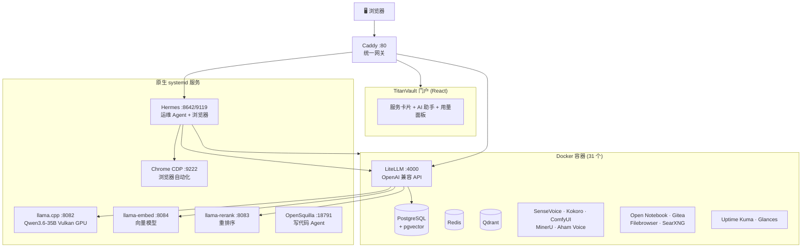

<div align="center">


# TitanVault · 天铸

**专为 AMD Ryzen AI Max+ 395 打造的开箱即用本地 AI 工作站。**

一条命令，把一台 395 迷你主机变成完整的 AI 技术栈——大模型推理、语音、文档解析、浏览器自动化、AI Agent、监控——全部本地运行，零云端、零数据外泄。

[](https://github.com/OWNER/TitanVault/actions)
[](LICENSE)
[](https://github.com/OWNER/TitanVault/stargazers)
[](https://github.com/OWNER/TitanVault/commits)
[](https://www.amd.com/en/products/processors/laptop/ryzen/ai-300-series.html)

[English](../README.md) · **简体中文**

</div>

<div align="center">

**🔧 零配置 · 📦 开箱即用 · 🖥️ 100% 本地 · 🔒 零数据外泄**

</div>

<picture>
  <source media="(prefers-color-scheme: dark)" srcset="./portal-dashboard.png">
  
</picture>

---

## ✨ 包含什么

| 能力 | 做什么 | 技术栈 |
|---|---|---|
| 🧠 **大模型推理** | Qwen3.6-35B 全量 offload，原生多模态（图文） | llama.cpp（Vulkan 后端） |
| 🎙️ **语音** | 语音转写 · 语音合成 · 会议纪要 | SenseVoice · Kokoro · Aham Voice |
| 📄 **文档** | PDF 解析（版面 + OCR + 表格） | MinerU（ROCm GPU） |
| 🎨 **图像** | Stable Diffusion 图像生成 | ComfyUI（ROCm GPU） |
| 🤖 **AI Agent** | 运维 Agent（管理 Docker/systemd）· 写代码 Agent | Hermes · OpenSquilla |
| 🌐 **浏览器自动化** | AI 驱动 Chrome：点击、填表、导航、截图 | browser-use + CDP |
| 📚 **应用** | 知识库 · Git · 文件管理 · 元搜索 | Open Notebook · Gitea · Filebrowser · SearXNG |
| 📊 **监控** | 18 项服务自动监控 · 系统资源 | Uptime Kuma · Glances |

所有服务经 **Caddy 网关**（:80）统一暴露，配套自定义 **TitanVault 门户**——React 仪表盘聚合全部服务入口、AI 助手和用量面板。

## 🔥 为什么造这个

大多数"AI 工作站"教程让你拼凑十几个工具、调几天 GPU 驱动、逐个手配服务。**TitanVault 恰恰相反：**

- **🔧 全自动** — 一条 `bash install.sh` 全搞定：GPU 驱动、Docker、镜像构建、模型下载、服务编排、密码生成、监控配置。零手动配置。
- **📦 开箱即用** — Open Notebook 自动配好 4 类模型；Uptime Kuma 自动灌入 18 项服务监控；Hermes 运维 Agent 预载硬件知识库。装完就能用，无需"初始化"。
- **🖥️ 100% 本地** — 所有推理跑在你的 395 GPU 上。无需 API key，不调云端，数据不出机器。首次安装后可离线使用。
- **🔒 天生隐私** — 密码自动生成，Caddy 注入鉴权头，`.env` 锁定 `600`。你的对话、文档、语音数据绝不触及第三方。
- **🔁 重装无忧** — 幂等安装器 + 凭据指纹检测。重装或升级不丢数据、不破坏配置。

## 🚀 一行安装

```bash
git clone https://github.com/OWNER/TitanVault.git
cd TitanVault
bash install.sh
```

安装器引导你选档位、自动装 GPU 驱动、拉镜像、下模型、启动全部服务。全新安装约 1 小时（含 30 分钟模型下载），利用缓存镜像/模型的重装约 15 分钟。

<details>
<summary><b>📋 安装阶段明细</b></summary>

| 阶段 | 做什么 | 耗时 | 需干预？ |
|---|---|---|---|
| 0 | 硬件检测（gfx1151 + Ubuntu） | 5 秒 | 否 |
| 1 | 交互配置（档位 / 数据目录 / 模型源）+ 生成密码 | 2 分钟 | **是** |
| 2 | GPU 驱动（GRUB + Mesa + Vulkan），重启一次 | ~15 分钟 | 重启 |
| 3 | Docker + 镜像（构建 ROCm + 拉第三方 + 离线包） | ~30 分钟 | 否 |
| 4 | 模型下载（35B + embedding + rerank + ASR） | ~30 分钟 | 否 |
| 5 | 启动（编译 llama.cpp + compose up + hermes/opensquilla/chrome） | ~10 分钟 | 否 |
| 6 | 完成——打印访问地址 + 密码 | 即时 | 记录密码 |

</details>

## 🎛️ 三档预设

| 预设 | 包含 | 适用 |
|---|---|---|
| **minimal** | LLM 推理核心（llama.cpp + LiteLLM + 门户） | 只需要本地 LLM API |
| **standard** | + 语音 / 文档 / 图像（AI 能力层） | 需要语音/文档/图像 AI |
| **full** | + 应用 + 监控 + Agent + 浏览器自动化 | 完整工作站 **（推荐）** |

## 🏗️ 架构



## 📡 主要端口

| 端口 | 服务 | 说明 |
|---|---|---|
| **80** | Caddy + TitanVault | 统一门户入口 |
| 4000 | LiteLLM | OpenAI 兼容 API（对话 / 向量 / 重排） |
| 8082 | llama-main | Qwen3.6-35B 推理（原生 systemd） |
| 9119 | Hermes Dashboard | 运维 Agent Web UI（通用对话） |
| 8642 | Hermes Gateway | 运维 Agent API（门户 AI 助手） |
| 18791 | OpenSquilla | 写代码 Agent 网关 |
| 9222 | Chrome CDP | 浏览器自动化后端 |
| 9991 | SenseVoice | 语音转写 API |
| 8188 | ComfyUI | Stable Diffusion |
| 8090 | MinerU Web | PDF 解析 |
| 3001 | Uptime Kuma | 服务监控 |

<details>
<summary><b>完整端口表（19 项服务）</b></summary>

| 端口 | 服务 |
|---|---|
| 80 | Caddy + TitanVault 门户 |
| 4000 | LiteLLM |
| 8082 / 8084 / 8083 | llama.cpp 主力 / 向量 / 重排 |
| 9119 / 8642 | Hermes 仪表盘 / 网关 |
| 18791 | OpenSquilla |
| 9222 | Chrome CDP |
| 9991 / 8081 | SenseVoice ASR / Kokoro TTS |
| 8765 | Aham Voice（会议纪要） |
| 8090 / 18080 | MinerU Web / API |
| 8188 | ComfyUI |
| 8088 / 5055 | Open Notebook |
| 3002 | Gitea |
| 8085 / 8087 | Filebrowser / SearXNG |
| 3001 | Uptime Kuma |
| 61208 | Glances |

</details>

## 🔧 硬件要求

| 要求 | 规格 |
|---|---|
| **APU** | AMD Ryzen AI Max+ 395（Radeon 8060S / gfx1151） |
| 系统 | Ubuntu 24.04 / 26.04 LTS |
| 内存 | 64 GB+（跑 35B 全 offload） |
| 磁盘 | 120 GB+（模型 31G + 镜像 70G + 数据） |
| 网络 | 首次安装需联网（拉镜像 + 下模型） |

> 仅支持 395。安装器在阶段 0 检测 GPU 型号，不匹配会拒绝。其它 GPU（NVIDIA / Intel / 其它 AMD）不在目标范围内。

## 📁 仓库结构

```
TitanVault/
├── install.sh              # 一行安装入口（阶段 0-6）
├── compose.yaml            # Compose include 入口（7 层 profile）
├── compose/                # 分层编排
├── images/                 # 原创镜像源码（titanvault/sensevoice/mineru-rocm/...）
├── native/                 # 原生 systemd 服务（llama.cpp/hermes/opensquilla/chrome-cdp）
├── config/                 # 配置模板（.env.example/caddy/litellm/hermes）
├── presets/                # minimal/standard/full 三档开关
├── hardware/               # aimax-395 专属参数
├── models/                 # 模型清单 + 下载源
├── scripts/                # download-models.sh / setup-kuma.sh / ...
├── images/offline/         # 预打包离线镜像
└── docs/                   # 用户文档
```

## 📖 文档

- **[快速开始](../docs/getting-started.md)** — 从零到运行
- **[服务清单](../docs/what-it-installs.md)** — 完整服务与端口
- **[运维手册](../docs/operations.md)** — 日常运维与服务管理
- **[故障排查](../docs/troubleshooting.md)** — 常见问题与修复
- **[自定义配置](../docs/customize.md)** — 调整模型 / 端口 / 密码

## 🤝 贡献

见 **[CONTRIBUTING.md](../CONTRIBUTING.md)**。本项目仅针对 AMD Ryzen AI Max+ 395——无法测试其它 GPU 的 PR 会被婉拒。

## 📜 许可证

Apache-2.0——见 [LICENSE](../LICENSE)。第三方组件各自遵循原始授权——见 [NOTICE](../NOTICE)。

## ⭐ Star History

<picture>
  <source media="(prefers-color-scheme: dark)" srcset="https://api.star-history.com/svg?repos=OWNER/TitanVault&type=Date&theme=dark">
  <source media="(prefers-color-scheme: light)" srcset="https://api.star-history.com/svg?repos=OWNER/TitanVault&type=Date">
  
</picture>

---

<div align="center">

基于 [llama.cpp](https://github.com/ggml-org/llama.cpp) · [LiteLLM](https://github.com/BerriAI/litellm) · [Hermes](https://github.com/NousResearch/hermes-agent) · [browser-use](https://github.com/browser-use/browser-use) · [MinerU](https://github.com/opendatalab/MinerU) · [ComfyUI](https://github.com/comfyanonymous/ComfyUI) 用 ❤️ 构建

</div>
