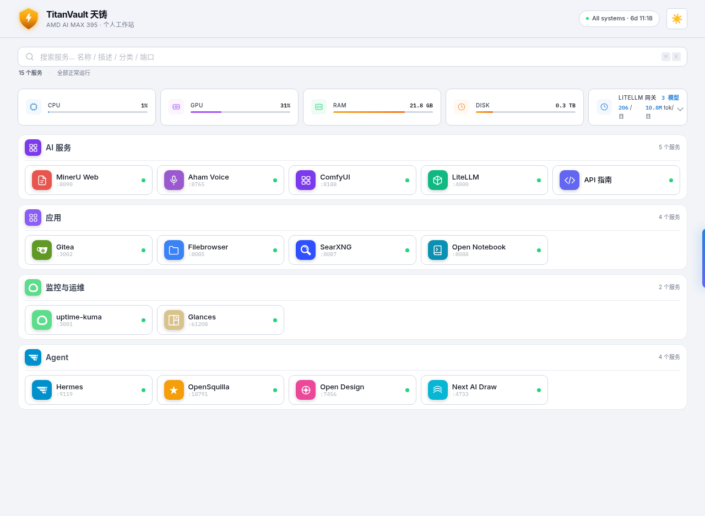
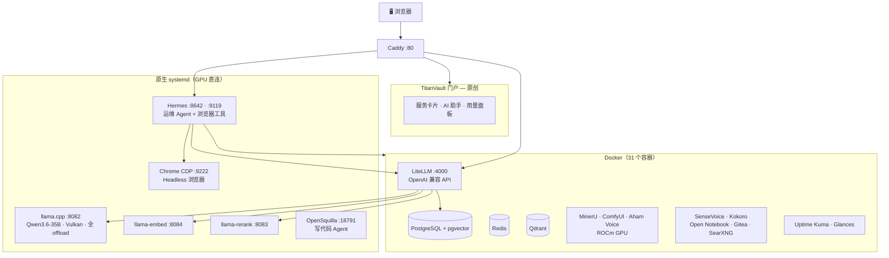

<div align="center">


# TitanVault · 天铸

**专为 AMD Ryzen AI Max+ 395（Strix Halo）打造的纯本地 AI 工作站。**

一条命令，把 Strix Halo 迷你主机变成完整的端侧 AI 技术栈——大模型推理、语音、文档解析、浏览器自动化、AI Agent——全部本地运行，无需云端，无需 API key。

[](LICENSE)
[](https://github.com/kaka86mm/TitanVault/stargazers)
[](https://github.com/kaka86mm/TitanVault/commits)
[-ED1C24?style=flat-square&logo=amd&logoColor=white)](https://www.amd.com/en/products/processors/laptop/ryzen/ai-300-series/amd-ryzen-ai-max-plus-395.html)

[English](../README.md) · **简体中文**

</div>

<div align="center">

**🔧 一条命令安装 · 📦 装完即用 · 🖥️ 100% 端侧推理 · 🔒 数据不离开本机**

</div>

<div align="center">
  <picture>
    <source media="(prefers-color-scheme: dark)" srcset="./portal-dashboard.png">
    
  </picture>
</div>

---

## 这是什么

TitanVault 是一个开源 AI 工作站发行版，专为 **AMD Ryzen AI Max+ 395**（代号 *Strix Halo*，GPU *gfx1151* / Radeon 8060S）设计。它利用这颗 APU 的 128GB 统一内存和 40 个 RDNA 3.5 计算单元，在**本地完整运行 350 亿参数大模型**，以及语音、视觉、文档处理、浏览器自动化和 AI Agent——全部通过统一门户提供。

不需要 OpenAI API key。不需要云端推理。数据不发给任何第三方。

## ✨ 能力

| | 能力 | 详情 | 技术栈 |
|---|---|---|---|
| 🧠 | **大模型推理** | Qwen3.6-35B-A3B，全量 GPU offload，原生多模态（文本+视觉） | llama.cpp → Vulkan |
| 🎙️ | **语音** | 实时语音转写 · 神经网络语音合成 · 会议录音转纪要（含说话人分离） | SenseVoice · Kokoro · Aham Voice |
| 📄 | **文档智能** | PDF 解析：版面分析 + OCR + 表格提取 | MinerU（ROCm） |
| 🎨 | **图像生成** | Stable Diffusion / SDXL | ComfyUI（ROCm） |
| 🤖 | **AI Agent** | 运维 Agent（管理 Docker/systemd）· 写代码 Agent · 定时任务 | Hermes · OpenSquilla |
| 🌐 | **浏览器自动化** | AI 驱动 headless Chrome：点击、输入、导航、读页面、识别验证码 | browser-use + CDP |
| 📚 | **效率应用** | 知识库（RAG）· 自托管 Git · 文件管理 · 元搜索 | Open Notebook · Gitea · Filebrowser · SearXNG |
| 📊 | **可观测性** | 18 项服务自动监控 · 实时系统指标 | Uptime Kuma · Glances |

所有服务经 **Caddy 反向代理**统一暴露，通过自研的 **TitanVault 门户**（React）呈现。

## 🔥 为什么用 TitanVault

搭建一套本地 AI 技术栈，通常意味着：花一个周末调试 ROCm/Vulkan 驱动，手动配置十几个服务，处理认证对接，最后还是得到一个脆弱的系统。TitanVault 把这些都消除了：

- **一条命令，全自动配置** — `bash install.sh` 完成 GPU 驱动、Docker、镜像构建、模型下载、服务编排、密码生成、监控初始化。走开一小时，回来一切就绪。
- **装完即用，无需二次配置** — Open Notebook 自动分配 4 类模型；Uptime Kuma 预装 18 项监控；Hermes 运维 Agent 自带硬件知识库。打开门户直接用。
- **完全离线运行** — 所有推理跑在你的 GPU 上。首次下载模型后，无需联网。
- **架构级隐私** — 密码自动生成并锁定，Caddy 处理鉴权注入，对话、文档、语音数据全程不出本机。
- **重装不丢数据** — 安装器幂等设计，凭据指纹检测。升级或重装不破坏已有数据和配置。

## 🛠️ 原创组件

TitanVault 不只是对现有工具的封装——它包含多个**专为这个发行版开发的开源原创组件**：

| 组件 | 做什么 | 源码 |
|---|---|---|
| **[TitanVault 门户](../images/titanvault-homepage/)** | 自研 React 仪表盘：服务卡片（品牌图标）、AI 助手对话、LLM 用量面板、实时运行状态 | [`images/titanvault-homepage/`](../images/titanvault-homepage/) |
| **[Aham Voice](https://github.com/kaka86mm/aham-voice-web)** | 全栈会议智能：音频上传 → 转写 → 说话人分离 → 情绪检测 → AI 生成会议纪要（ROCm GPU） | [kaka86mm/aham-voice-web](https://github.com/kaka86mm/aham-voice-web) · [本地镜像](../images/aham-voice-web/) |
| **[SenseVoice](../images/sensevoice/)** | 轻量 ASR API 服务：实时语音转文字，含情绪和语音事件检测 | [`images/sensevoice/`](../images/sensevoice/) |
| **[Token 用量 API](../images/token-usage-api/)** | LLM 消耗追踪：聚合 LiteLLM 用量日志，提供可视化面板 | [`images/token-usage-api/`](../images/token-usage-api/) |
| **[API Discover](../images/api-discover/)** | 自动生成 API 浏览器：发现所有服务、测试端点、渲染交互文档 | [`images/api-discover/`](../images/api-discover/) |

另外还有为 gfx1151 适配的自定义 ROCm Dockerfile：[MinerU](../images/mineru-rocm/) 和 [ComfyUI](../images/comfyui-rocm/)——官方 CUDA 镜像在这颗 APU 上跑不了，这里用 ROCm/HIP 后端重新构建。

## 🚀 快速开始

```bash
git clone https://github.com/kaka86mm/TitanVault.git
cd TitanVault
bash install.sh
```

安装器引导你选择档位、安装 GPU 驱动、构建镜像、下载模型、启动全部服务。首次安装约 1 小时，利用缓存的重装约 15 分钟。

> **📦 离线安装（国内）：** 如果 Docker Hub 被墙，下载[离线镜像包](https://github.com/kaka86mm/TitanVault/releases/tag/v0.2.0)（1.5GB）放到 `images/offline/` 目录，安装器会自动加载。不下载也能装，4 源镜像 fallback 兜底，但冷门镜像可能拉取失败。

<details>
<summary><b>📋 安装阶段明细</b></summary>

| 阶段 | 做什么 | 耗时 | 需要你？ |
|---|---|---|---|
| 0 | 硬件验证（gfx1151 + Ubuntu） | 5 秒 | 否 |
| 1 | 交互配置：档位 / 数据目录 / 模型源 | 2 分钟 | **是** |
| 2 | GPU 驱动（GRUB + Mesa + Vulkan），重启一次 | ~15 分钟 | 重启 |
| 3 | Docker 镜像（构建 ROCm + 拉取 + 离线包） | ~30 分钟 | 否 |
| 4 | 模型下载（35B + embedding + reranker + ASR） | ~30 分钟 | 否 |
| 5 | 编译 llama.cpp → 启动全部服务和 Agent | ~10 分钟 | 否 |
| 6 | 打印访问地址和密码 | 即时 | 保存密码 |

</details>

## 🎛️ 档位

| 档位 | 包含 | 适合 |
|---|---|---|
| **minimal** | LLM 推理核心（llama.cpp + LiteLLM + 门户） | 只需要本地 LLM API |
| **standard** | + 语音 / 文档 / 图像 AI | 语音转写、PDF 解析、图像生成 |
| **full** | + 应用 + Agent + 浏览器自动化 + 监控 | 完整工作站 **（推荐）** |

## 🏗️ 架构



## 📡 端口

| 端口 | 服务 | 说明 |
|---|---|---|
| **80** | Caddy + TitanVault 门户 | 主入口 |
| 4000 | LiteLLM | OpenAI 兼容 API |
| 8082 | llama.cpp 主力 | Qwen3.6-35B（Vulkan GPU） |
| 9119 | Hermes 仪表盘 | Agent Web UI |
| 8642 | Hermes 网关 | Agent API（门户 AI 助手） |
| 9222 | Chrome CDP | 浏览器自动化 |
| 9991 | SenseVoice | 语音转写 API |
| 8188 | ComfyUI | 图像生成 |
| 8090 | MinerU | PDF 解析 |

<details>
<summary><b>全部端口（24 项服务）</b></summary>

| 端口 | 服务 |
|---|---|
| 80 | Caddy + TitanVault 门户 |
| 4000 | LiteLLM |
| 8082 / 8084 / 8083 | llama.cpp（主力 / 向量 / 重排） |
| 9119 / 8642 | Hermes（仪表盘 / 网关） |
| 18791 | OpenSquilla |
| 9222 | Chrome CDP |
| 9991 / 8081 | SenseVoice / Kokoro TTS |
| 8765 | Aham Voice（会议纪要） |
| 8090 / 18080 | MinerU（Web / API） |
| 8188 | ComfyUI |
| 8088 / 5055 | Open Notebook |
| 3002 | Gitea |
| 8085 / 8087 | Filebrowser / SearXNG |
| 3001 / 61208 | Uptime Kuma / Glances |

</details>

## 🔧 硬件

| | 规格 |
|---|---|
| **APU** | AMD Ryzen AI Max+ 395（Strix Halo / gfx1151 / Radeon 8060S） |
| 系统 | Ubuntu 24.04 或 26.04 LTS |
| 内存 | 64GB+（128GB 推荐，跑 35B 全 offload） |
| 磁盘 | 120GB+ 可用空间 |
| 网络 | 仅首次安装需要联网 |

> 仅支持 Ryzen AI Max+ 395。安装器在阶段 0 验证 GPU 型号，不匹配会终止。其它硬件不支持。

### 🇨🇳 国内用户说明

Docker Hub 和 GitHub 在国内经常慢或不可达。TitanVault 通过多重 fallback 应对：

- **Docker 镜像**：4 源自动 failover（`1ms.run` → `1panel.live` → `xuanyuan.me` → `daocloud`）
- **模型下载**：安装时选 `cn`，从 ModelScope 下载（而非 HuggingFace）
- **npm 包**（browser-use）：用 `registry.npmmirror.com`
- **PyPI 包**：用清华/阿里云镜像
- **GitHub 源码克隆**：多源 fallback（`github.com` → `ghfast.top` → `gh-proxy.com` → `gitee.com`）

**离线包** — 如果镜像源全部失败，下载[离线镜像包](https://github.com/kaka86mm/TitanVault/releases/tag/v0.2.0)放到 `images/offline/` 目录，安装器会自动 `docker load`。

> 💡 GitHub Release 下载也可能慢。如遇此情况，可用 [ghproxy.com](https://ghproxy.com) 等加速服务。

## 📁 仓库结构

```
TitanVault/
├── install.sh                # 安装器（6 阶段，可断点续接）
├── compose.yaml              # Docker Compose 入口（7 层 profile）
├── compose/                  # 分层服务定义
├── images/                   # 原创组件源码（门户、ASR、会议纪要、...）
├── native/                   # systemd 服务（llama.cpp、Hermes、OpenSquilla、Chrome）
├── config/                   # 配置模板（.env、Caddy、LiteLLM、Hermes）
├── presets/                  # minimal / standard / full
├── hardware/                 # Strix Halo 专属参数
├── models/                   # 模型清单 + 下载配置
├── scripts/                  # 自动化脚本（模型、监控、Notebook、...）
└── docs/                     # 文档
```

## 📖 文档

| 文档 | 内容 |
|---|---|
| [快速开始](../docs/getting-started.md) | 安装与首次运行 |
| [服务清单](../docs/what-it-installs.md) | 全部服务、端口、模型 |
| [运维手册](../docs/operations.md) | 日常管理 |
| [故障排查](../docs/troubleshooting.md) | 常见问题与修复 |
| [自定义配置](../docs/customize.md) | 模型、端口、密码 |

## ⚠️ 项目状态

本项目处于早期阶段。目前仅在作者的机器上测试过（Framework 迷你主机，Ryzen AI Max+ 395，128GB 内存）。在不同硬件配置、Ubuntu 版本或网络环境下可能存在问题。

**遇到问题？** 欢迎[提 issue](https://github.com/kaka86mm/TitanVault/issues)，请附上：
- 硬件信息（`rocminfo | head`）
- 失败的阶段和错误日志
- Ubuntu 版本和安装档位

## 🤝 贡献

见 [CONTRIBUTING.md](../CONTRIBUTING.md)。本项目**仅**支持 Ryzen AI Max+ 395——无法测试其它 GPU 的 PR 不会被接受。

## 📜 许可证

Apache-2.0——见 [LICENSE](../LICENSE)。第三方组件各自遵循原始授权——见 [NOTICE](../NOTICE)。

## ⭐ Star History

<picture>
  <source media="(prefers-color-scheme: dark)" srcset="https://api.star-history.com/svg?repos=kaka86mm/TitanVault&type=Date&theme=dark">
  <source media="(prefers-color-scheme: light)" srcset="https://api.star-history.com/svg?repos=kaka86mm/TitanVault&type=Date">
  
</picture>

---

<div align="center">

基于 [llama.cpp](https://github.com/ggml-org/llama.cpp) · [LiteLLM](https://github.com/BerriAI/litellm) · [Hermes](https://github.com/NousResearch/hermes-agent) · [browser-use](https://github.com/browser-use/browser-use) · [MinerU](https://github.com/opendatalab/MinerU) · [ComfyUI](https://github.com/comfyanonymous/ComfyUI) 构建

</div>
